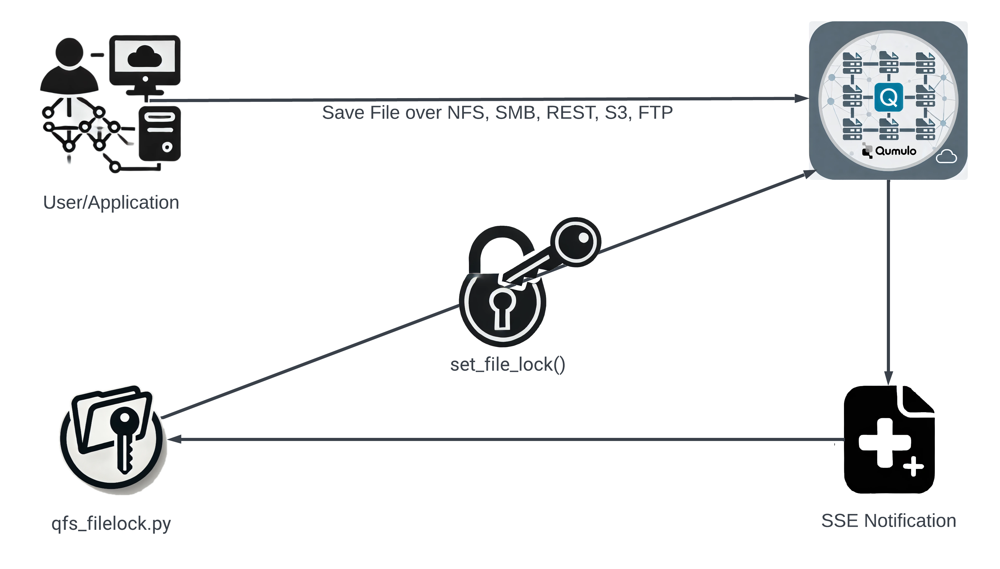

# QFS File Lock Script

## Why File Locking? 

File locking in a Qumulo file system is beneficial for customers needing to comply with immutable data retention policies, whether required by company policies or mandated by regulations. It provides a mechanism to WORM protect (Write Once Read Many) files, ensuring that data, once written, cannot be modified or deleted until a specified retention period has been reached. This feature is especially useful in industries like finance, healthcare, and legal sectors, where data integrity and compliance are critical. Qumulo’s file locking capability protects against accidental or malicious data alterations, making it a valuable tool for long-term data preservation.

<p align="center">
  
</p>

<p align="center">
QFS File Lock Process Flow Diagram
</p>

## Overview 

The `qfs_filelock.py` script monitors directories on a Qumulo cluster for changes such as new file creation. The script leverages the Qumulo SDK/API for interacting with the file system, making it a powerful tool for administrators looking to enforce strict data protection policies on their Qumulo storage clusters.

It listens for events via [SSE Payload Notification Types](#sse-payload-notification-types), streaming JSON-encoded notifications to the client. The file notifications can be specified based on the available types listed [here](#sse-payload-notification-types). 

When changes are detected, the script attempts to apply a Write Once Read Many (WORM) lock to the affected file, ensuring the integrity and immutability of critical data. Notifications are processed serially, but customers can modify the script to meet their requirements. It also allows for recursive monitoring of all subdirectories and includes a debug mode for detailed logging. 

> *Note: Performance may be impacted when there are many or deeply nested subdirectories to monitor, or when more than 100,000 files exist in a single directory.*

## Installation

To use the `qfs_filelock.py` script, you'll need to install the required Python packages. The following instructions assume you are running Ubuntu, however, this script can also be run on Windows, assuming you have Python 3 and the required packages installed.

### Prerequisites

1. Ensure Python 3 is installed:

    ```bash
    sudo apt-get update
    sudo apt-get install -y python3 python3-pip
    ```

2. Install the necessary Python packages:

    ```bash
    pip3 install argparse configparser requests urllib3 datetime qumulo-api python-daemon
    ```

    For Windows, the same `pip3 install` command can be used from your Command Prompt or PowerShell.

3. Ensure you are using a version of the Qumulo Python SDK >= 7.2.1 

```
$ pip3 show qumulo-api | grep Version
Version: 7.2.1
```

### Installing the Script

1. Clone the repository:

    ```bash
    git clone https://github.com/Qumulo/filelock.git
    cd filelock
    ```

2. Ensure the script is executable (on Unix-like systems):

    ```bash
    chmod +x qfs_filelock.py
    ```

3. Create the configuration file, example below.

`qfs_filelock_config.ini`:

```ini
[DEFAULT]
API_HOST = qumulo-cluster.example.com
API_PORT = 8000
USERNAME = admin
PASSWORD = your_password_here
```

### Configuration Setup with `--configure` Option

The `--configure` option is a new feature that allows you to interactively create a configuration file for the script. This option simplifies the setup process by guiding you through the necessary steps to configure the script for your Qumulo cluster.

#### When to Use `--configure`

- **First-Time Setup:** If you are setting up the script for the first time, the `--configure` option will help you generate a valid configuration file with minimal effort.
- **Updating Configuration:** Use `--configure` to update an existing configuration file, such as when the API host, port, or user credentials change.

#### How It Works

When you run the script with the `--configure` option, it will prompt you for the following details:

- **API Host:** The hostname or IP address of your Qumulo cluster.
- **API Port:** The port number for the Qumulo API (typically 8000).
- **Username:** The username used to log in to the Qumulo cluster.
- **Password:** The password associated with the specified username.

Based on your inputs, the script will generate a configuration file (`qfs_filelock_config.ini` by default) that stores these details securely.

#### Example Usage

To create or update the configuration file:

```bash
./qfs_filelock.py --configure
```

The script will then guide you through the configuration process:

```
Configuring qfs_filelock_config.ini
Enter API Host: <your_api_host>
Enter API Port: <your_api_port>
Enter Username: <your_username>
Enter Password: <your_password>
```

Once completed, the script will save the configuration file, and you will see a confirmation message:

```
Configuration saved to qfs_filelock_config.ini
```

#### Benefits of Using `--configure`

- **Ease of Use:** No need to manually edit configuration files. The script automatically creates the file based on your inputs.
- **Error Prevention:** Reduces the likelihood of errors that might occur when manually editing the configuration file, such as syntax errors or incorrect field names.
- **Security:** Passwords are handled securely within the script, ensuring that your credentials are not exposed unnecessarily.

This option is especially useful for users who are new to the script or for administrators who need to quickly update the configuration on multiple systems.

## Getting Started

The script offers various options based on your monitoring and locking needs.


### Basic Usage

1. **Monitoring a Specific Directory by File ID.**

    *(A directory in a file system utilizes an inode similar to a file, which is why it’s referred to as a file id)*

    ```bash
    ./qfs_filelock.py --file-id <FILE_ID> --config-file <CONFIG_FILE_PATH>
    ```

2. **Monitoring a Directory by Path:**

    ```bash
    ./qfs_filelock.py --directory-path <DIRECTORY_PATH> --config-file <CONFIG_FILE_PATH>
    ```

3. **Enabling Debug Mode:**

    Debug mode provides detailed logging to help diagnose issues.

    ```bash
    ./qfs_filelock.py --directory-path <DIRECTORY_PATH> --config-file <CONFIG_FILE_PATH> --debug
    ```

4. **Recursive Monitoring:**

    To monitor all subdirectories within a specified directory:

    ```bash
    ./qfs_filelock.py --directory-path <DIRECTORY_PATH> --config-file <CONFIG_FILE_PATH> --recursive
    ```

5. **Setting Polling Interval:**

    By default, the script polls for notifications every 15 seconds. This can be adjusted using the `--interval` option, including "0" which locks the file immediately.

    ```bash
    ./qfs_filelock.py --directory-path <DIRECTORY_PATH> --config-file <CONFIG_FILE_PATH> --interval 30
    ```

    **Note on Timing:** You may need to adjust this interval based on the types of notifications being monitored and/or the size of the file being written. For example, if you include `child_file_added` and `child_data_written`, it is possible that the file is locked before the data is fully written.

6. **Saving Output to a File:**

    You can save the output to a file instead of printing it to STDOUT by specifying the `--output` option:

    ```bash
    ./qfs_filelock.py --directory-path <DIRECTORY_PATH> --config-file <CONFIG_FILE_PATH> --output /path/to/output.log
    ```

### Example Execution

```bash
./qfs_filelock.py --directory-path /data/important_files --config-file ~/qfs_filelock_config.ini --recursive --debug --interval 20
```

This command monitors the `/data/important_files` directory and all its subdirectories for changes, locks files upon changes, and logs detailed debug information.

## SSE Payload Notification Types

The following table describes the various SSE payload notification types. For more details, refer to the [Qumulo Documentation on Watching File Attribute and Directory Changes](https://docs.qumulo.com/administrator-guide/watching-file-attribute-directory-changes/rest.html).

| Notification Type            | Description                                                                 |
|------------------------------|-----------------------------------------------------------------------------|
| `child_acl_changed`           | ACL for the listed file or directory has been modified.                     |
| `child_atime_changed`         | `atime` (access time) of the listed file or directory has been modified.    |
| `child_btime_changed`         | `btime` (creation time) of the listed file or directory has been modified.  |
| `child_mtime_changed`         | `mtime` (modification time) of the listed file or directory has been modified. |
| `child_data_written`          | Data has been written to the listed file.                                   |
| `child_dir_added`             | The listed directory has been created.                                      |
| `child_dir_removed`           | The listed directory has been removed.                                      |
| `child_dir_moved_from`        | The listed directory has been moved from its location.                      |
| `child_dir_moved_to`          | The listed directory has been moved to a new location.                      |
| `child_file_added`            | The listed file has been added to the directory.                            |
| `child_file_removed`          | The listed file has been removed from the directory.                        |
| `child_file_moved_from`       | The listed file has been moved from its location.                           |
| `child_file_moved_to`         | The listed file has been moved to a new location.                           |
| `child_extra_attrs_changed`   | Extra attributes of the listed file or directory have been modified.        |

## Helpful Commands

Authenticate to the Qumulo `qq` CLI prior to running these commands. For example: `qq --host X.X.X.X login -u admin -p your_password_here`

1. **Determining a Directory's File Number:**

    You can determine a directory's file number using the Qumulo `qq` CLI command:

    ```bash
    qq --host X.X.X.X fs_file_get_attr --path /path/to/directory | jq .file_number
    ```

2. **Locking a File Using the CLI:**

    You can manually lock a file using the Qumulo `qq` CLI command by path or the directory's file number (id):

    ```bash
    qq --host X.X.X.X fs_file_set_lock --path /path/to/directory/this_is_a_locked.file --days 1
    ```

    ```bash
    qq --host X.X.X.X fs_file_set_lock --file-id 133742 --days 1
    ```

3. **Verifying if a File is Locked**

    To verify if a file has been successfully locked, you can use the following Qumulo `qq` CLI command:

    ```bash
    qq --host X.X.X.X fs_file_get_attr --path /path/to/directory/this_is_a_locked.file --retrieve-file-lock | jq .lock
    ```

    This command retrieves the file's attributes, including the lock status, and displays it using `jq`.

4. **Example of setting Legal Hold on all files written to a specific directory**

    *This was performed on a new Ubuntu 22_04 server*

    ### Install Required Python3 Packages
    ```bash
    pip3 install argparse configparser requests urllib3 datetime qumulo-api python-daemon
    ```

    ### Authenticate to the Qumulo Cluster
    ```bash    
    qq --host 10.1.2.3 login -u admin -p MyPassword2!
    ```

    ### Configure qfs_filelock
    ```bash
    python3 ./qfs_filelock.py --configure
    Configuring qfs_filelock_config.ini
    Enter API Host: 10.1.2.3
    Enter API Port: 8000
    Enter Username: admin
    Enter Password: MyPassword2!
    ```

    ### Start the filelock script with the required parameters

    ```bash
    ./qfs_filelock.py --directory-path /filelock_test/subdir1 --recursive --interval 0 --legal-hold
    ```

    ### Verifying a file has been put on legal-hold

    ```bash
    qq --host 10.1.2.3 fs_file_get_attr --path /filelock_test/subdir1/locked_file_77.txt --retrieve-file-lock | jq .lock
    {
      "legal_hold": true,
      "retention_period": null
    }
    ```

## Troubleshooting

The script includes a debug mode, has verbose logging, and you can save the output to a file for further analysis.

- The debug mode can be enabled with the `--debug` flag.
   - When debug mode is enabled, the script generates detailed log entries that can be useful for troubleshooting.
   - The logging is controlled by Python's `logging` module, which allows for flexible log management.

- In addition to printing log messages to the console, you can also save the output to a file by using the `--output` option.
   - This is particularly useful if you need to retain logs for audit purposes or further analysis.

### Common Issues and Resolutions

1. **Connection Timeouts:**
   - **Symptom:** The script fails to connect to the Qumulo cluster, and logs indicate a timeout.
   - **Resolution:** Verify network connectivity between the machine running the script and the Qumulo cluster. Ensure that the API host and port in the configuration file are correct.

2. **Authentication Errors:**
   - **Symptom:** The script returns authentication errors when trying to log in to the Qumulo cluster.
   - **Resolution:** Double-check the username and password in the configuration file. Ensure that the user has the necessary permissions to perform file locking.

3. **Unexpected Script Termination:**
   - **Symptom:** The script stops running unexpectedly or returns an unhandled exception.
   - **Resolution:** Run the script with the `--debug` flag to capture detailed logs. Check the logs for any specific error messages that could indicate the cause. Ensure that all required arguments are provided, and the configuration file is correctly set up.

4. **File Lock Not Effective:**
   - **Symptom:** Files are not being locked as expected.
   - **Resolution:** Ensure that either a valid retention period or legal hold is specified. If neither is set, the script will log a warning and the lock will not be effective.

5. **Log File Size Management:**
   - **Symptom:** The log file specified with the `--output` option grows too large.
   - **Resolution:** Implement log rotation using tools like `logrotate` on Linux. Alternatively, periodically archive and clear the log file manually.

6. **Performance Degradation with Large Directories:**
   - **Symptom:** The script runs slowly or uses excessive CPU/memory when monitoring large directories or deeply nested subdirectories.
   - **Resolution:** Reduce the number of monitored directories if possible, or increase the polling interval using the `--interval` option. Consider running the script on a more powerful machine if hardware limitations are causing the slowdown.

7. **Handling SIGPIPE Errors:**
   - **Symptom:** The script fails with a BrokenPipeError when running in a piped command sequence.
   - **Resolution:** The script now handles SIGPIPE signals gracefully. If you encounter this issue, ensure that the latest version of the script is being used, which includes the `signal.signal(signal.SIGPIPE, signal.SIG_DFL)` line.

8. **Missing File or Directory Error:**
   - **Symptom:** The script logs errors about missing files or directories.
   - **Resolution:** Verify that the paths specified in the `--directory-path` or `--file-num` options exist and are accessible by the script.

### Logging and Debugging Tips

- **Log Levels:** Use `--debug` for maximum verbosity in logs. You can also modify the logging level in the script to capture different levels of detail.
- **Log Analysis:** Regularly review logs for any recurring issues, especially in long-running processes or scripts running as daemons.
- **Time Synchronization:** Ensure that the system clock on the machine running the script is synchronized with the Qumulo cluster, as discrepancies can cause issues with time-based operations like retention periods.

By following these troubleshooting steps, you should be able to resolve most issues encountered while using the `qfs_filelock.py` script.
   
## Relevant Links

- [Watching for File Attribute and Directory Changes Using REST](https://docs.qumulo.com/administrator-guide/watching-file-attribute-directory-changes/rest.html)
- [Qumulo REST API Guide](https://docs.qumulo.com/rest-api-guide/)
- [Qumulo Documentation Home](https://docs.qumulo.com/)
- [Qumulo Official Website](https://qumulo.com/)
- [Qumulo Search](https://qumulo.com/search.html)
- [Qumulo Resources](https://qumulo.com/resources/)

## FAQ

1. **Is this auditable?**

   Yes, the script uses the existing auditing system.

2. **Who can delete a file?**

   There is an RBAC "LOCK_ADMIN" privilege required to remove legal holds.

3. **Can I put an entire directory on legal hold?**

   File locking is performed on a per-file basis today; you cannot lock directories.

4. **How can I see all files that are locked on a cluster?**

   Currently, there is no built-in way to list all locked files; you would need to use a custom script.


## About the Author

This script was developed by Kevin McDonald (KMac) kmac@qumulo.com in August 2024. Qumulo, Inc. is a leader in scalable file storage solutions, and this script reflects our commitment to providing robust tools for data management and protection. If you have any questions or need further assistance, please contact us at support@qumulo.com.

